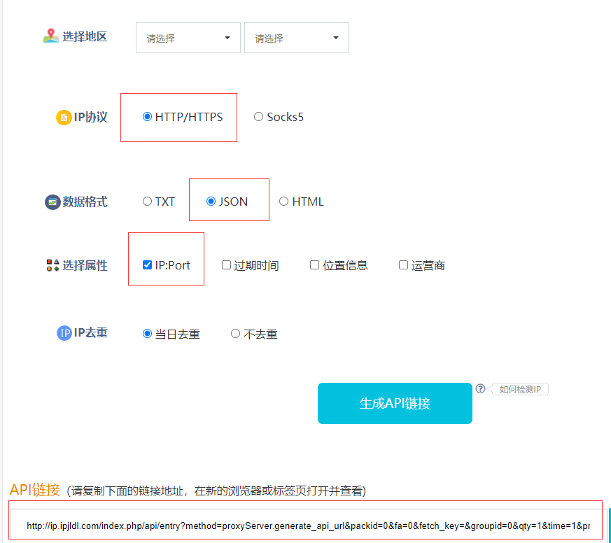

# 专利页面爬虫(请酌情爬取)
>本爬虫爬取链接为[知网中国专利](http://nvsm.cnki.net/kns/brief/result.aspx?dbprefix=scpd)
>注：本项目为v2，第一版参见：[CrawlPage](https://github.com/sky94520/CrawlPage)<br>
>该版本目前可以爬取所有专利  
>针对知网专利，本代码主要有4部分:  
>
>| 爬虫 | 功能 |
>| ---- | ---- |
>| page.py | 根据条件筛选，爬取专利列表|
>| detail.py |根据专利列表爬取专利的具体信息|
>|number.py| page.py的改写，用于获取申请人的专利数量|
>|status.py|根据专利列表获取专利的状态|
>相关说明  
>1. run_page.py 负责启动page爬虫(便于调试)  
>知网的搜索条件是先根据搜索条件得到cookie，当出现验证码的时候重新请求获取cookie或对验证码进行识别（本项目重新进行请求）
>page爬虫使用了文件(checkpoint json格式文件)作为断点和队列，该文件由PersistParam类自动生成，当需要开启一个新的任务的时候，请删除原先的checkpoint文件；
>当某一块爬取完成后，page爬虫检查队列是否有数据，有则设置断点，并开始爬取;
>2. run_detail.py 负责启动detail爬虫(便于调试)；
>3. hownet_config.py 提供了一些常用的知网搜索页面配置类，可根据条件自行添加和修改
>4. PagePersistParam.py 该文件主要负责遍历/files/pending/下的所有json格式文件，并把每一个字典作为一个请求，该类用于page爬虫的断点
##文件夹
>files文件夹目录说明:
>```
>├─detail detail爬虫爬取文件存放路径  
>│  ├─html   
>│  └─json  
>├─page page爬虫爬取文件存放路径  
>│  ├─html  
>│  ├─json  
>│  └─pending 保存着待爬取的（条件）文件 json格式  
>│  └─read 存放着已经爬取完成的文件  
>│  └─checkpoint.json 检查点  
>├─pending  
>├─status status爬虫爬取后的文件存放路径  
>│   ├─html  
>│   └─json  
>└─checkpoint.json 检查点  
>``
## 配置文件
>pending/ *.json 或者 page/pending/ *.json
>```
>{
>   "keyword": "5G",
>   "condition": "and",
>   "main_cls_number": "H04L"
>}
>```
>表示搜索主题为5G，并且主分类号为H04L的所有中国专利
>也可以使用专家检索，比如搜索 申请人为```武汉大学```和发明人为```张绍东```：
>```
>{
>   "expertvalue": "SQR='武汉大学' and FMR='张绍东'"
>}
>```
>### config.py
>该配置文件用于一些敏感的数据项  
>PROXY_URL，用于提供代理，比如
>```
>PROXY_URL = '127.0.0.1:5555/random'
>```
>主要由Proxy类提供代理，当前的逻辑是同一时刻仅仅使用一个代理，当这个代理不可用的时候，才会重新进行请求
>目前使用的为[代理精灵](http://http.zhiliandaili.com/Index-getapi.html)  
>配置如下：
>
>如果想要把数据存储到mysql中，还需要配置MySQL，比如：
>```
>MYSQL_CONFIG = {
>    'user': 'root',
>    'password': 'qweryty1234',
>    'database': 'ren_db',
>    'host': '127.0.0.1',
>    'port': 3306,
>}
>```
>### hownet_config.py
>该文件用来保存知网的各个搜索条件的配置，目前根据输入的字典的键来自动匹配配置类
>比如pending文件夹的内容格式为：
>```
>[
>   {
>       "applicant": "东南大学"
>   },
>   ...
>]
>```
>那么使用的则是ApplicantConfig
>```
>class ApplicantConfig(BaseConfig):
>    """申请人配置"""
>    @staticmethod
>    def get_params(applicant):
>        params = {
>            "action": "",
>            "NaviCode": "*",
>            "ua": "1.21",
>            "isinEn": "0",
>            "PageName": "ASP.brief_result_aspx",
>            "DbPrefix": "SCPD",
>            "DbCatalog": "中国专利数据库",
>            "ConfigFile": "SCPD.xml",
>            "db_opt": "SCOD",
>            "db_value": "中国专利数据库",
>            "txt_1_sel": "SQR",
>            "txt_1_value1": applicant,
>            "txt_1_relation": "#CNKI_AND",
>            "txt_1_special1": "=",
>            "his": 0,
>            "__": BaseConfig._get_now_gmt_time()
>        }
>        return params
>```
## 1.page爬虫
>### 1.1 思路
>run_page.py会开启爬虫
>page.py爬虫会判断checkpoint中队列中的数据(主分类号、申请人)，顺序爬取。
>爬虫在每次抓取页面成功后，会保存页面并解析页面，它也会判断当前的页面的专利个数。
>### 1.2 文件命名规范
>列表页命名 files/pending/中保存有待爬取的列表，以该列表的第一个元素为名称，文件名为页码(按照年份爬取的页面依次递增)
>比如
>```
>[
>   {
>       'applicant': '东南大学'
>   }
>]
>```
>则以东南大学作为文件夹的名称
>### 1.3 问题
>1. [错误twisted.internet.error.TimeoutError: User timeout caused connection failure](https://blog.csdn.net/xiongzaiabc/article/details/89840730)
>2. 目前会根据环境中的config变量来获取到不同的配置文件
## 2.detail 专利[基础信息]爬虫
>### 2.1 思路
>run_detail.py可以开启detail爬虫,
>detail.py爬虫需要的格式如下(该格式可以由page爬虫生成)：
>```
>[
>   {
>       'dbcode': 'scpd',
>       'dbname': 'scpd年份',
>        'filename': 专利公开号
>   }
>   ,
>   //...
>]
>```
>该爬虫目前会遍历files/page_links/下的所有文件(级联文件夹)，并yield Request
>### 2.2 数据清洗
>数据可以保存到JSON/MongoDB中，同时，注意保证公开号的唯一
>目前有两个数据类型为数组：发明人和专利分类号(源数据用分号隔开)
>注：发明人 专利分类号 中间用分号隔开 就算只有一个也是用数组
>### 2.3 数据提取
>可以按照tr[style!='display:none']提取每一行，接着xpath('./td').extract()提取出
>该行所有的td
>```
>for td in tds:
>   if td.text() in self.mapping():
>       key = self.mappings()
>       value = td.next()
>       item[key] = value
>```
>## 3.run_page_and_detail.py
>以/pending下的每个dict作为一条，先调用page.py 然后调用detail.py，以此类推
## Spider
> detail 爬取专利的详细信息的爬虫  
> number 按照条件获取专利个数
> page 按条件获取专利列表，供detail status爬虫使用
> status 按照专利申请号爬取专利状态，如果未查询到专利的状态，则没有status字段和information字段
>```
>{
>  "publication_number": "CN201660686U",
>  "array": [
>    {
>      "date": "未查询到本专利法律状态信息。Code:-3."
>    }
>  ]
>}
>```
## Proxy
> 每个请求都会重试若干次以上（比如代理不可用等问题都会使得请求失败），同时会在最后一次尝试不再使用代理
>如果最后一次仍然失败，则将该出错记录下来。
## middleware
> GetFromLocalityMiddleware detail爬虫专属，在爬取之前会先判断本地是否存在对应的专利html文件
> RetryOrErrorMiddleware 重写最大值重试次数中间件 功能只是添加了一个日志输出 <br>
> ProxyMiddleware 使用requests库请求获取代理<br>
> CookieMiddleware page爬虫专用，设置cookie，会检测spider的cookie是否已经不可用，如果不可用，则重新发起请求获取 <br>
## pipeline
>| 类名 | 功能 | 存储路径 |
>| ---- | ---- | ---- |
>|SaveSearchJsonPipeline| 用于把解析出来的搜索数据保存到json文件中|search/json|
>|SaveSearchHtmlPipeline| 保存原始的搜索页面| search/json|
>|FilterPipeline | detail专属，用于过滤数据，更改数据格式| -|
>|SaveDetailHtmlPipeline| 保存详细专利html页面到本地| detail/html|
>|SaveDetailJsonPipeline| 保存详细专利json数据到本地| detail/json |
>
>### MySQLDetailPipeline
>多线程插入专利到数据库，使用adbapi创建数据库连接池
>```
># MYSQL_CONFIG为dict，格式同上
>db_pool = adbapi.ConnectionPool('pymysql', cursorclass=cursors.DictCursor, **MYSQL_CONFIG)
>```
>然后在process_item中插入到数据库
>```
>def process_item(self, item, spdier):
>    # 减小数据量,见详解
>    copy = dict(item)
>    # 成功则调用self.handle_success，否则则调用handle_error
>    query = self.db_pool.runInteraction(import_patent, copy, self.handle_success)
>    query.addErrback(self.handle_error)
>    return DropItem()
>```
>import_patent函数的参数为```(cursor, item, success_callback)```  
>当在import_patent中发生错误时，将会调用handle_error函数。  
>注：import_patent函数是消费者，而爬虫则是生产者，当爬取专利的速度大于
>插入专利的速度时，将会导致内存占用越来越高，该问题目前只能通过把数据转换为dict，但
>只是延缓内存增长的速度，并没有解决该问题。
